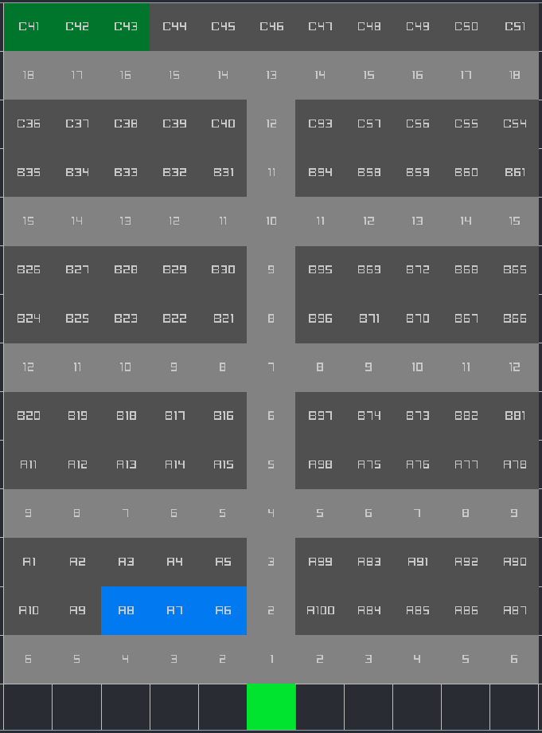

<!-- Improved compatibility of back to top link: See: https://github.com/othneildrew/Best-README-Template/pull/73 -->

<a id="readme-top"></a>

<!--
*** Thanks for checking out the Best-README-Template. If you have a suggestion
*** that would make this better, please fork the repo and create a pull request
*** or simply open an issue with the tag "enhancement".
*** Don't forget to give the project a star!
*** Thanks again! Now go create something AMAZING! :D
-->

<!-- PROJECT SHIELDS -->
<!--
*** I'm using markdown "reference style" links for readability.
*** Reference links are enclosed in brackets [ ] instead of parentheses ( ).
*** See the bottom of this document for the declaration of the reference variables
*** for contributors-url, forks-url, etc. This is an optional, concise syntax you may use.
*** https://www.markdownguide.org/basic-syntax/#reference-style-links
-->

[![github][github-shield]][github-url]

<!-- PROJECT LOGO -->
<br />
<div align="center">
<h3 align="center">Parking Lot Manager </h3>

  <p align="center">
    P1 projekt for 1 semester software AAU
    <br />
    
  </p>
  <a href="https://github.com/github_username/repo_name">
    
  </a>

</div>

<!-- TABLE OF CONTENTS -->
<details>
  <summary>Table of Contents</summary>
  <ol>
    <li>
      <a href="#about-the-project">About The Project</a>
      <ul>
        <li><a href="#built-with">Built With</a></li>
      </ul>
    </li>
    <li>
      <a href="#getting-started">Getting Started</a>
      <ul>
        <li><a href="#prerequisites">Prerequisites</a></li>
        <li><a href="#prerequisites">Generating parking structure</a></li>
        <li><a href="#running">Running the parking manager</a></li>
      </ul>
    </li>
    <li><a href="#contributors">Contributors</a></li>
  </ol>
</details>

<!-- ABOUT THE PROJECT -->

## About The Project

The goal of this project was optimizing parking times for drivers, looking to park in an parking structure that is almost at full capacity
</br>
</br>
The project is split in two programs:

1. A interface to create prioritized parking structures
2. A parking manager that can assign cars parking lots based on priority and different variables.
   </br>

<p align="right">(<a href="#readme-top">back to top</a>)</p>

### Built With

![C][C]
</br>
![CMake][CMake]
</br>
![RayLib][RayLib]

<p align="right">(<a href="#readme-top">back to top</a>)</p>

<!-- GETTING STARTED -->

## Getting Started

Start by cloning the repository

```sh
git clone https://github.com/MikkelRasmussen/P1.git
```

### Prerequisites

For the parking manager to run as a simulation.</br> In the file main.c change

```C
//simulateAssignmentTime(cars, carCount, parkinglots, fileLength - 1);
parkingMenu(parkinglots, fileLength - 1, cars, carCount);
```

to

```C
simulateAssignmentTime(cars, carCount, parkinglots, fileLength - 1);
//parkingMenu(parkinglots, fileLength - 1, cars, carCount);
```

And in the file parkingLotData.c its important to comment out line 63 and 72

```C
Line 63 //char *occupancyStr = strtok(NULL, ",");
Line 72 //*status = atoi(occupancyStr);
```

And in the file parkingLot comment out

```C
// parkinglots[i].status = VACANT; // Initially vacant - COMMENTED OUT WHEN SIMULATING
```

And make sure that the files containing information regarding cars, are corresponding correctly in main.c and getparkingData.c with your saved file.

```C
FILE *file = fopen("--> export.pexport <--", "r");
struct car *cars = loadCarsFromCSV("--> simulation1.csv <--", &carCount);
```

### Generating parking structure

1. How to use the parking structure design and optimization:
   First start by making a new project by clicking the leftest most button in the top bar.
2. Then you can select the different tools in the toolbar in the bottom to create parking spots, roads and entrances.
3. When clicking on parking spots with the selector tool, properties for the selected parking spot show up in the inspector panel to the left. Here the type, zone and, ID can be changed.
4. The project can then be saved or exported by clicking the other buttons in the top bar. (Save it as export.pexport project folder, for it being accessible for the parking manager.)

### Running the Parking Manager

#### From Source

<details>
<summary>Prerequisites</summary>
Software
<ul>
  <li>Visual Studio Code</li>
  <li>VSCode CMake Extension
  <li>Visual Studio C/C++ Build Tools</li>
  <li>VCPKG</li>
</ul>
Libraries
<ul>
  <li>Raylib</li>
  <li>Raygui</li>
  <li>NativeFileDialog-Extended</li>
</ul>

A `VCPKG_ROOT` environment variable is also required.

</details>

To run the Parking Manager you need to run the VSCode command `CMake: Debug`, which is by default assigned to the shortcut `Shift+F5`.

### Running the Parking Allocator

Choose what command you want to execute.

```sh
===== PARKING MENU =====
 1. Assign a car to a lot
 2. Deassign a car from a lot
 3. Look up a car by number plate
 4. Show all parking lots
 5. Add a new car
 6. Exit
 Enter choice:
```

1. Gives you the option to assign an imported car to the parking structure.
   ```C
   1. Assign a car to a lot
   ```
2. Gives you the option to remove an car from the parking structure, and freeing the lot for a new car.
   ```C
   2. Deassign a car from a lot
   ```
3. Search information regarding a specific car by the numberplate
   ```C
   3. Look up a car by number plate
   ```
4. Prints out an overview over all parking lots and their current information.
   ```C
   4. Show all parking lots
   ```
5. Gives you the option to add a car by typing information regarding it, and then assigns it automaticly to a parking lot.
   ```C
   5. Add a new car
   ```
6. Stops the program from running.
   ```C
   6. Exit
   ```

<p align="right">(<a href="#readme-top">back to top</a>)</p>

<!-- Contributors -->

## Contributors

[Github](https://github.com/DefendParis) - Frederik Peter Bräuner</br>
[Github](https://github.com/jeppe1007) - Jeppe Duedahl Jensen</br>
[Github](https://github.com/NoahHorslev) - Noah Horselv Petersen</br>
[Github](https://github.com/LyraWT) - Lyra Winther Tybo</br>
[Github](https://github.com/Buggsiii) - Frederik Bugge Jørgensen</br>
[Github](https://github.com/MikkelRasmussen) - Mikkel Buus Rasmussen</br>

Project Link: [https://github.com/MikkelRasmussen/P1](https://github.com/MikkelRasmussen/P1)

<p align="right">(<a href="#readme-top">back to top</a>)</p>

<!-- MARKDOWN LINKS & IMAGES -->
<!-- https://www.markdownguide.org/basic-syntax/#reference-style-links -->

[github-shield]: https://img.shields.io/badge/github-repo-blue?logo=github
[github-url]: https://github.com/MikkelRasmussen/p1
[product-screenshot]: images/screenshot.png

<!-- Shields.io badges. You can a comprehensive list with many more badges at: https://github.com/inttter/md-badges -->

[CMake]: https://img.shields.io/badge/CMake-%23008FBA.svg?style=for-the-badge&logo=cmake&logoColor=white
[C]: https://img.shields.io/badge/c-%2300599C.svg?style=for-the-badge&logo=c&logoColor=white
[RayLib]: https://img.shields.io/badge/RAYLIB-808080?style=for-the-badge&logo=raylib&logoColor=white
